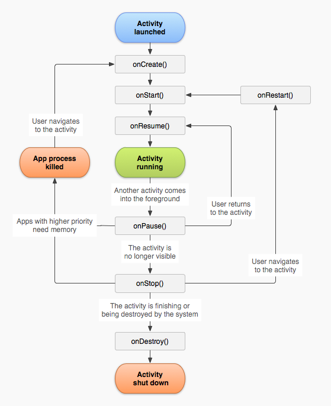

## 模板方法
Template Pattern

**1、含义**
- 封装流程
- 把某个固定流程封装到一个final函数中，让子类能够定制这个流程中的某些方法或所有步骤

**2、适用场景**
- 多个子类有公有方法，并且逻辑基本相同
- 重要，复杂的算法，可以把核心算法设计为模板方法，周边的相关细节功能则由各个子类实现
- 重构时，模板方法是一个经常使用的模式，把相同代码抽取到父类中，然后通过钩子函数约束其行为

**3、优点**
- 封装不变部分，拓展可变部分
- 提取公有部分代码，便于维护

**4、缺点**
- 模板方法会带来代码阅读难度，让阅读者难以理解。

## 模板方法在Android中使用

Activity生命周期中，7个生命周期方法
Activity显示流程
AsyncTask执行流程

